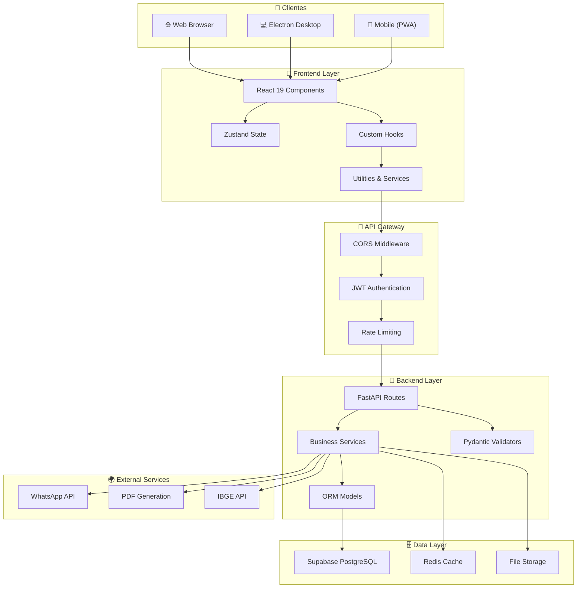

# 🏗️ Architecture - Aulevi Kiosk

Documentação da arquitetura do sistema Aulevi Kiosk.

---

## 📋 Tabela de Conteúdos

- [Visão Geral](#-visão-geral)
- [Diagrama de Arquitetura](#-diagrama-de-arquitetura)
- [Camadas](#-camadas)
- [Frontend](#-frontend)
- [Backend](#-backend)
- [Desktop](#-desktop)
- [Data Flow](#-data-flow)
- [Design Patterns](#-design-patterns)
- [Escalabilidade](#-escalabilidade)

---

## 🎯 Visão Geral

Aulevi Kiosk é um sistema multi-plataforma de geração de orçamentos com:

```
┌─────────────────────────────────────────────────┐
│           APRESENTAÇÃO (Frontend)               │
│      React 19 + TypeScript + Vite + Tailwind    │
│  Web (navegador) + Desktop (Electron wrapper)   │
└─────────────┬───────────────────────────────────┘
              │ HTTP/REST
┌─────────────▼───────────────────────────────────┐
│           LÓGICA DE NEGÓCIO (Backend)           │
│         FastAPI + Python 3.10+                  │
│     Quote Generation, PDF, WhatsApp, etc.       │
└─────────────┬───────────────────────────────────┘
              │ PostgreSQL/SQL
┌─────────────▼───────────────────────────────────┐
│          PERSISTÊNCIA (Database)                │
│      Supabase (PostgreSQL) + Armazenamento      │
└─────────────────────────────────────────────────┘
```

---

## 📊 Diagrama de Arquitetura



---

## 📚 Camadas

### 1️⃣ Apresentação (Frontend)

**Responsabilidades:**
- Interface do usuário
- Captura de entrada
- Validação client-side
- Estado local

**Componentes principais:**
- `pages/` - Páginas principais (MainMenu, LSFFlow, MadeiramentoFlow, CatalogFlow, Standby)
- `components/` - Componentes reutilizáveis
- `hooks/` - Lógica customizada
- `services/` - Comunicação com API
- `store/` - Estado global (Zustand)

### 2️⃣ Aplicação (Backend)

**Responsabilidades:**
- Lógica de negócio
- Validação server-side
- Geração de orçamentos
- Autenticação/Autorização
- Integração com serviços externos

**Componentes principais:**
- `routes/` - Endpoints REST
- `services/` - Lógica de negócio
- `models/` - ORM Models
- `schemas/` - Pydantic validators

### 3️⃣ Persistência (Database)

**Responsabilidades:**
- Armazenar dados
- Consultas/índices
- Transações
- Backups

**Componentes principais:**
- Supabase PostgreSQL
- Tabelas relacionais
- Índices otimizados

### 4️⃣ Integração (External)

**Responsabilidades:**
- Comunicação com serviços externos
- PDF generation
- WhatsApp API
- IBGE API

---

## 🎨 Frontend

### Stack Tecnológico

```
React 19.2.5          # UI Framework
TypeScript 6.0.2      # Type safety
Vite 8.0.10           # Build tool
Tailwind CSS 3.4.19   # Styling
Framer Motion 12.38   # Animations
React Router 7.15     # Navigation
Zustand 5.0.13        # State management
Axios 1.16.0          # HTTP client
```

### Estrutura de Pastas

```
frontend/
├── src/
│   ├── pages/              # Page components
│   │   ├── MainMenu.tsx
│   │   ├── LSFFlow.tsx
│   │   ├── MadeiramentoFlow.tsx
│   │   ├── CatalogFlow.tsx
│   │   └── Standby.tsx
│   ├── components/         # Reusable components
│   │   ├── LeadCaptureModal.tsx
│   │   ├── CatalogFlow/
│   │   ├── LSFFlow/
│   │   └── MadeiramentoFlow/
│   ├── hooks/              # Custom hooks
│   │   ├── useLSFFlow.ts
│   │   ├── useCitySearch.ts
│   │   ├── useImageCarousel.ts
│   │   └── useInactivityTimeout.ts
│   ├── services/           # API communication
│   │   ├── api.ts
│   │   └── ibgeService.ts
│   ├── store/              # Global state
│   │   └── useKioskStore.ts
│   ├── constants/          # Constants
│   ├── utils/              # Utilities
│   └── App.tsx
└── public/                 # Static assets
    └── assets/
```

### Data Flow

```
User Input
    ↓
Component State (useState)
    ↓
Custom Hook (useLSFFlow, etc)
    ↓
Global Store (Zustand)
    ↓
API Service (api.ts)
    ↓
Axios HTTP Request
    ↓
Backend
```

### Responsividade

```
Breakpoints (Tailwind):
- Mobile:  < 768px   (base classes)
- Tablet:  768-1024px (md: prefix)
- Desktop: > 1024px  (xl: prefix)

Exemplo:
<div className="text-2xl md:text-3xl xl:text-5xl">
  Responsive text
</div>
```

---

## 🐍 Backend

### Stack Tecnológico

```
FastAPI 0.109.0       # Web framework
Python 3.10+          # Language
SQLAlchemy 2.0.0      # ORM
PostgreSQL via Supabase
Pydantic 2.0.0        # Validation
Pyppeteer 1.0.2       # PDF generation
```

### Estrutura de Pastas

```
backend/
├── main.py                 # App entry point
├── config/
│   └── settings.py         # Configuration
├── database/
│   └── connection.py       # DB connection
├── models/
│   ├── __init__.py
│   └── quote_model.py      # ORM models
├── schemas/
│   ├── __init__.py
│   └── quote_schema.py     # Pydantic schemas
├── routes/
│   └── quote_routes.py     # API endpoints
├── services/
│   ├── pricing_service.py  # Price calculation
│   ├── pdf_service.py      # PDF generation
│   ├── supabase_service.py # DB service
│   └── whatsapp_service.py # WhatsApp service
├── templates/              # PDF templates
│   ├── quote_template.html
│   ├── madeiramento_template.html
│   └── chale_template.html
└── tests/
    └── test_pricing_service.py
```

### Request Flow

```
HTTP Request
    ↓
CORS Middleware
    ↓
JWT Authentication
    ↓
Rate Limiting
    ↓
Route Handler
    ↓
Pydantic Validation
    ↓
Business Service
    ↓
Database/External Service
    ↓
Response Serialization
    ↓
HTTP Response
```

### Database Schema

```sql
-- Simplified view
CREATE TABLE quotes (
    id UUID PRIMARY KEY,
    lead_id UUID NOT NULL REFERENCES leads,
    product_type VARCHAR(50),
    area DECIMAL(10, 2),
    total_price DECIMAL(12, 2),
    status VARCHAR(20),
    created_at TIMESTAMP,
    updated_at TIMESTAMP
);

CREATE TABLE leads (
    id UUID PRIMARY KEY,
    name VARCHAR(255),
    phone VARCHAR(20),
    email VARCHAR(255),
    city VARCHAR(100),
    interested_in VARCHAR(50),
    created_at TIMESTAMP
);

CREATE TABLE products (
    id UUID PRIMARY KEY,
    name VARCHAR(255),
    category VARCHAR(50),
    type VARCHAR(50),
    price_per_m2 DECIMAL(10, 2)
);
```

---

## 💻 Desktop

### Stack Tecnológico

```
Electron 28.0.0       # Desktop framework
Node.js               # Runtime
```

### Estrutura

```
electron-wrapper/
├── main.js            # Electron main process
├── package.json
└── dist/              # Build output
```

### Process Flow

```
Electron Main Process (main.js)
    ↓
Create BrowserWindow
    ↓
Load React App (http://localhost:5173 ou built version)
    ↓
User Interaction
    ↓
React Components
    ↓
API Calls
    ↓
Backend
```

---

## 🔄 Data Flow

### Quote Creation Flow

```
┌─────────────────────────────────────────────┐
│ 1. User Interaction (Frontend)              │
│    - Selects product (LSF, Madeiramento)   │
│    - Enters dimensions, city, etc          │
└────────────────┬────────────────────────────┘
                 │
┌────────────────▼────────────────────────────┐
│ 2. Form Validation (Frontend)               │
│    - Client-side validation                 │
│    - Zustand state update                   │
└────────────────┬────────────────────────────┘
                 │
┌────────────────▼────────────────────────────┐
│ 3. API Call (Frontend → Backend)            │
│    - POST /api/v1/quotes                    │
│    - JSON payload with all data             │
└────────────────┬────────────────────────────┘
                 │
┌────────────────▼────────────────────────────┐
│ 4. Backend Validation & Processing          │
│    - Pydantic validation                    │
│    - Business logic (pricing calculation)   │
│    - Database insert                        │
└────────────────┬────────────────────────────┘
                 │
┌────────────────▼────────────────────────────┐
│ 5. PDF Generation                           │
│    - Puppeteer renders template             │
│    - Saves to /generated_quotes             │
└────────────────┬────────────────────────────┘
                 │
┌────────────────▼────────────────────────────┐
│ 6. Response (Backend → Frontend)            │
│    - Quote ID, total price, PDF URL         │
│    - Store in Zustand                       │
└────────────────┬────────────────────────────┘
                 │
┌────────────────▼────────────────────────────┐
│ 7. UI Update (Frontend)                     │
│    - Show confirmation screen               │
│    - Enable PDF download/WhatsApp share     │
└─────────────────────────────────────────────┘
```

---

## 🎯 Design Patterns

### 1. Service Pattern

```python
# Backend - Separar lógica de negócio
class PricingService:
    @staticmethod
    def calculate_quote(area, roof_type, city):
        # Lógica de cálculo
        pass

# Em routes
@app.post("/quote")
def create_quote(request: QuoteRequest):
    total = PricingService.calculate_quote(
        request.area,
        request.roof_type,
        request.city
    )
```

### 2. Hooks Pattern

```typescript
// Frontend - Lógica reutilizável
export const useLSFFlow = () => {
  const [step, setStep] = useState(0);
  const [data, setData] = useState({});
  
  const goToNext = () => setStep(s => s + 1);
  const goToPrev = () => setStep(s => s - 1);
  
  return { step, data, setData, goToNext, goToPrev };
};

// Uso
function LSFFlow() {
  const { step, goToNext } = useLSFFlow();
}
```

### 3. Middleware Pattern

```python
# Backend - Middleware para cross-cutting concerns
app.add_middleware(CORSMiddleware, ...)
app.add_middleware(AuthMiddleware, ...)
app.add_middleware(RateLimitMiddleware, ...)
```

### 4. Repository Pattern

```python
# Backend - Abstrair database access
class QuoteRepository:
    @staticmethod
    def create(db, quote_data):
        quote = Quote(**quote_data)
        db.add(quote)
        db.commit()
        return quote
    
    @staticmethod
    def find_by_id(db, quote_id):
        return db.query(Quote).filter(Quote.id == quote_id).first()
```

---

## 📈 Escalabilidade

### Horizontal Scaling

```
Load Balancer (nginx/HAProxy)
    ↓
┌───────────────────────────────┐
│ Backend Instance 1            │
│ Backend Instance 2            │
│ Backend Instance 3            │
└───────────────────────────────┘
    ↓
Database (Supabase - Managed)
```

### Performance Optimizations

```
1. Database:
   - Connection pooling
   - Indexes on frequently queried columns
   - Query optimization

2. Frontend:
   - Code splitting
   - Lazy loading components
   - Image optimization
   - Caching

3. Backend:
   - Caching with Redis
   - Async operations
   - Request compression
   - CDN for static files
```

### Caching Strategy

```
Frontend:
- Browser cache (images, CSS, JS)
- localStorage for user preferences
- Memory cache for API responses

Backend:
- Redis for expensive queries
- HTTP cache headers
- ETag for conditional requests
```

---

## 🔒 Security Layers

```
Frontend:
- Input validation
- XSS protection (DOMPurify)
- CSRF token (if applicable)

Transport:
- HTTPS/TLS
- HSTS headers

Backend:
- JWT authentication
- Rate limiting
- Input validation (Pydantic)
- CORS whitelist
- SQL injection prevention (SQLAlchemy ORM)

Database:
- Encryption at rest
- SSL connections
- Access control
- Audit logs
```

---

## 🧪 Testing Strategy

```
Unit Tests:
- Services (pricing, PDF generation)
- Utils functions
- Validations

Integration Tests:
- API endpoints
- Database operations
- External service calls

E2E Tests:
- User workflows
- Quote creation flow
- PDF generation
```

---

## 📞 Support

- **Documentation**: [README.md](README.md)
- **Email**: parizi57@gmail.com

---

**Última atualização:** 29 de maio de 2026
